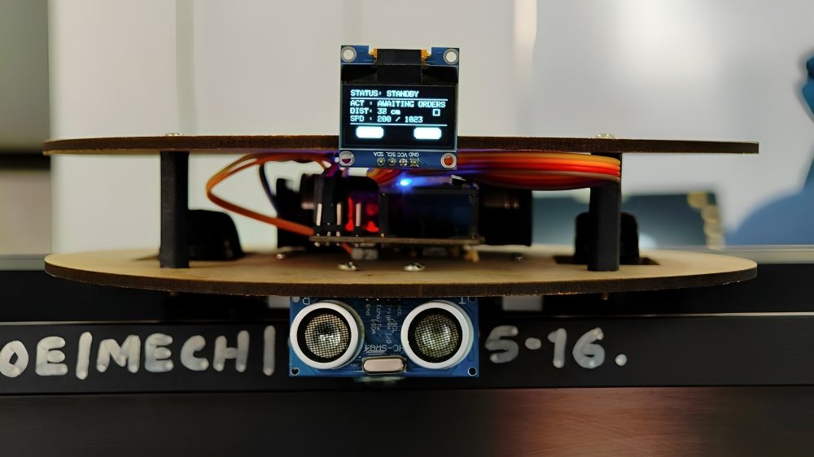
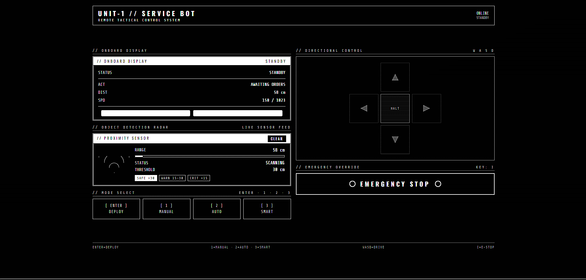

# 🤖 NEXUS – Autonomous Service Robot

**NEXUS** An intelligent WiFi-enabled mobile robot designed to demonstrate autonomous navigation, obstacle avoidance, and real-time embedded control on resource-constrained hardware.

Built around the ESP8266 NodeMCU, NEXUS combines wireless communication, sensor-based decision making, differential drive control, and a browser-based control interface into a single autonomous robotic platform.

---
## How it Works

**NEXUS** creates its own WiFi network and hosts a web-based control dashboard that can be accessed from any smartphone, tablet, or computer browser. The ESP8266 continuously processes commands, reads distance data from the ultrasonic sensor, controls motor movement through the L298N motor driver, and updates the OLED display in real time. 

The robot supports three operating modes: 

* **Manual Mode** – User directly controls movement through the web interface.
* **Autonomous Mode** – Robot independently detects and avoids obstacles while navigating its environment.
* **Smart Mode** – User controls the robot manually while automatic obstacle avoidance remains active in the background.

A non-blocking state-machine architecture allows sensor monitoring, navigation decisions, web server communication, and display updates to run simultaneously, ensuring smooth and responsive operation.

## 🧠 System Architecture

NEXUS hosts its own WiFi network and web interface, allowing any device on the network to control the robot directly through a browser.

The robot continuously:

* Reads ultrasonic sensor data
* Processes navigation decisions
* Updates the OLED display
* Handles web requests
* Controls motor movement

all simultaneously without blocking execution.

---

## 🔧 Hardware Stack

| Component         | Purpose              |
| ----------------- | -------------------- |
| ESP8266 NodeMCU   | Main Controller      |
| HC-SR04           | Distance Measurement |
| L298N Driver      | Motor Control        |
| N20 Geared Motors | Differential Drive   |
| SSD1306 OLED      | Status Display       |
| 7.4V LiPo Battery | Power Supply         |

---

## 🚀 Navigation Modes

### 🎮 Manual Mode

Direct browser-based control using movement commands.

### 🤖 Autonomous Mode

Fully autonomous movement with obstacle detection and route correction.

### 🧠 Smart Mode

User controls the robot while obstacle avoidance remains active in the background.
## Highlights

🌐 Browser-based robot control (No mobile app required) \
🚗 Manual, Autonomous & Smart Navigation modes \
📡 ESP8266-hosted WiFi control panel \
🚧 Real-time obstacle detection and avoidance \
⚡ Non-blocking firmware architecture using `millis()`  \
📺 OLED status display with live robot feedback \
🛑 Emergency stop and safety lock mechanism \
🔋  Fully portable battery-powered platform 

---

## 🎯 Project Objective

The goal of NEXUS was to design a compact service robot capable of autonomous operation while maintaining real-time responsiveness, wireless accessibility, and efficient obstacle avoidance using low-cost hardware.

---

## 👨‍💻 Author

Ammar Shaikh

Robotics & Automation Engineer

If you found this project interesting, feel free to star the repository and connect with me.
